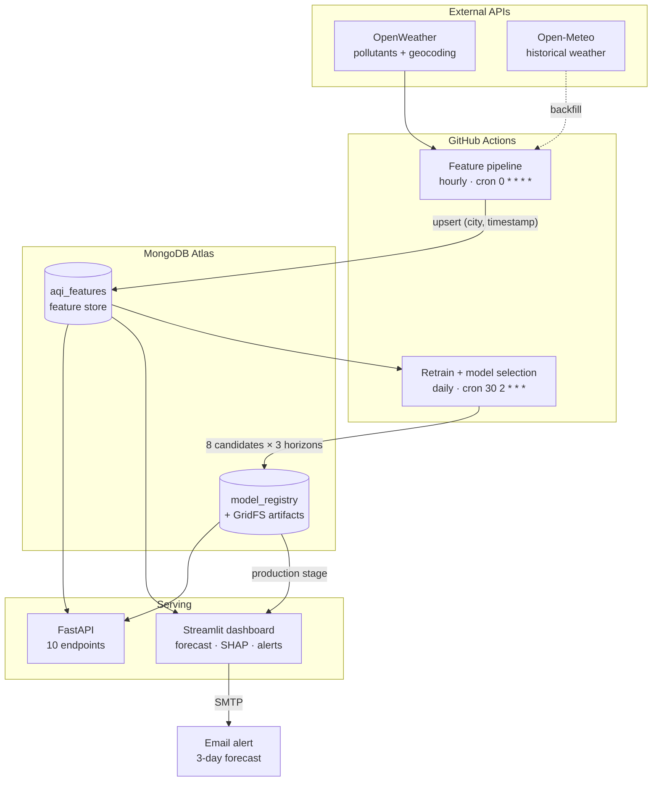

# Air Quality Index Predictor

**A 100% serverless, end-to-end ML system that forecasts the Air Quality Index for Karachi 3 days ahead** — hourly data collection, a feature store, automated model selection across 8 candidate families, a versioned model registry, SHAP explanations, hazardous-air alerts, and a live dashboard. Built for the **10Pearls Shine Internship Program**.

| | |
|---|---|
| **Live dashboard** | **https://karachi-air-quality-index-predictor.streamlit.app/** |
| **Repository** | https://github.com/githubSubhanKhan/Air-Quality-Index-Predictor |
| **Data** | 8,723 hourly readings · 2025-08-15 → present · continuously growing |
| **Forecast** | Mean AQI for day 1 / day 2 / day 3 ahead |
| **Accuracy** | Day 1 MAE **3.68** (R² 0.868) · Day 2 **6.87** (R² 0.588) · Day 3 **9.02** (R² 0.320) |
| **Automation** | Feature pipeline hourly · retrain + model selection daily (GitHub Actions) |

This README doubles as the project report: [§8 Evaluation methodology](#8-evaluation-methodology) explains why the numbers above are trustworthy, and [§9 Limitations](#9-limitations-and-next-steps) states plainly what is not done.

---

## Contents

1. [Requirement coverage](#1-requirement-coverage)
2. [Architecture](#2-architecture)
3. [Results](#3-results)
4. [Quickstart](#4-quickstart)
5. [Repository map](#5-repository-map)
6. [How it works](#6-how-it-works)
7. [API reference](#7-api-reference)
8. [Evaluation methodology](#8-evaluation-methodology)
9. [Limitations and next steps](#9-limitations-and-next-steps)
10. [Tech stack](#10-tech-stack)

---

## 1. Requirement coverage

Every row maps a requirement from the project brief to the code that satisfies it. Status is honest: two rows are **not done** and say so.

### Step 1 — Feature pipeline

| Requirement | Status | Implementation |
|---|---|---|
| Fetch raw weather + pollutant data from an external API | ✅ | [`fetch_openweather.py`](app/src/features/fetch_openweather.py) (pollutants, current + history, geocoding), [`fetch_openmeteo.py`](app/src/features/fetch_openmeteo.py) (historical weather), [`fetch_waqi.py`](app/src/features/fetch_waqi.py) (alternate live source) |
| Compute features (model inputs) and targets (model outputs) | ✅ | [`build_openweather_features.py`](app/src/features/build_openweather_features.py), [`feature_engineering.py`](app/src/features/feature_engineering.py), targets in [`train.py`](app/src/training/train.py) (`add_forecast_targets`) |
| Store the features in a feature store | ✅ | [`feature_store.py`](app/src/features/feature_store.py) — MongoDB Atlas `aqi_features`, upserted on `(city, timestamp)` |
| Time-based features (hour, day, month) | ✅ | `create_calendar_features` — `hour`, `day`, `month`, `day_of_week`, plus cyclical `hour_sin/cos`, `doy_sin/cos` |
| Derived features like AQI change rate | ✅ | `aqi_change_rate`, plus lags, rolling means/std, and deviation-from-trailing-mean features ([§6.4](#64-feature-engineering)) |

### Step 2 — Backfill historical (features, targets)

| Requirement | Status | Implementation |
|---|---|---|
| Run the feature script over a range of past dates to build training data | ✅ | [`backfill.py`](app/src/features/backfill.py) — `python -m app.src.features.backfill --city karachi --days 365`. **365 days backfilled**, pollutants from OpenWeather + weather from Open-Meteo |

### Step 3 — Training pipeline

| Requirement | Status | Implementation |
|---|---|---|
| Fetch historical (features, targets) from the feature store | ✅ | `load_feature_store` in [`train.py`](app/src/training/train.py) |
| Train and evaluate the **best model possible** for this data | ✅ | 8-candidate slate evaluated **per horizon on every retrain**, winner chosen on a held-out validation block ([§6.5](#65-model-training-and-selection)) |
| Experiment with Scikit-learn models (Random Forest, Ridge Regression) | ✅ | `random_forest`, `ridge`, `hist_gbm` in [`candidates.py`](app/src/training/candidates.py); 5-model notebook comparison in [`lag_feature_engineering.ipynb`](app/notebooks/lag_feature_engineering.ipynb) |
| TensorFlow / PyTorch for advanced models | ❌ **Not done** | The only outstanding model-variety gap — see [§9](#9-limitations-and-next-steps) |
| Store the trained model in a Model Registry | ✅ | [`model_registry.py`](app/src/registry/model_registry.py) — MongoDB + GridFS, versioning, stages, promotion gate, rollback, retention ([§6.6](#66-model-registry)) |
| Evaluate with RMSE, MAE and R² | ✅ | All three per horizon, plus a persistence baseline R² and a skill score, recorded with every registry version |

### Step 4 — Automate pipeline runs

| Requirement | Status | Implementation |
|---|---|---|
| CI/CD running the feature script **every hour** | ✅ | [`data_pipeline.yml`](.github/workflows/data_pipeline.yml) — `cron: "0 * * * *"` |
| CI/CD running the training script **every day** | ✅ | [`daily_training.yml`](.github/workflows/daily_training.yml) — `cron: "30 2 * * *"`, with a post-retrain smoke test and the candidate comparison rendered into the job summary |

### Step 5 — Web app

| Requirement | Status | Implementation |
|---|---|---|
| Load the model and features from the feature store | ✅ | [`predictor.py`](app/src/prediction/predictor.py) loads the **production** stage of the registry; [`forecast.py`](app/src/prediction/forecast.py) loads features |
| Compute predictions and show them on a simple, descriptive dashboard | ✅ | [`streamlit_app.py`](streamlit_app.py) — **[live](https://karachi-air-quality-index-predictor.streamlit.app/)** |
| Use Streamlit/Gradio **and** Flask/FastAPI | ✅ | Streamlit dashboard + FastAPI service with 10 endpoints ([§7](#7-api-reference)). The dashboard reads MongoDB directly so it can be deployed standalone |

### Guidelines

| Guideline | Status | Implementation |
|---|---|---|
| Perform EDA to identify trends | ✅ | [`eda.ipynb`](app/notebooks/eda.ipynb) — trends over time, distribution, hour-of-day and day-of-week profiles, missingness, correlation heatmap |
| A variety of forecasting models, **from statistical modelling** … | ✅ | Seasonal naive, Holt-Winters ETS, seasonal AR / SARIMA in [`statistical.py`](app/src/training/statistical.py) |
| … **to deep learning models** | ❌ **Not done** | See [§9](#9-limitations-and-next-steps) |
| Use SHAP or LIME for feature importance | ✅ | [`explainer.py`](app/src/explain/explainer.py) — TreeSHAP + exact linear attribution, local *and* global, stored per registry version, surfaced in the dashboard and the API ([§6.8](#68-explainability)) |
| Add alerts for hazardous AQI levels | ✅ | Dashboard banner + email alerts with health guidance ([§6.9](#69-hazardous-air-alerts)) |

### Final submissions

| Deliverable | Status | Where |
|---|---|---|
| 1. End-to-end AQI prediction system | ✅ | This repository |
| 2. A scalable, automated pipeline | ✅ | Two GitHub Actions workflows; MongoDB + GridFS; no server to run ([§2](#2-architecture)) |
| 3. An interactive dashboard showing real-time and forecasted AQI | ✅ | **[karachi-air-quality-index-predictor.streamlit.app](https://karachi-air-quality-index-predictor.streamlit.app/)** |
| 4. A detailed report documenting everything achieved | ✅ | This README, in particular [§6](#6-how-it-works), [§8](#8-evaluation-methodology) and [§9](#9-limitations-and-next-steps) |

**24 of the 26 rows above are complete.** Both open rows are the same single gap — deep-learning models — which is stated again in [§9](#9-limitations-and-next-steps) rather than buried.

---

## 2. Architecture

Serverless throughout: no host to keep running. GitHub Actions provides the compute, MongoDB Atlas the state, Streamlit Community Cloud the front end — all on free tiers.



**The forecast itself** is persistence plus a damped, learned correction:

```
forecast = current AQI + alpha × model(features)
```

The model learns the *deviation* from the current reading rather than the absolute level, and `alpha` is fitted on a validation window. A model with no skill collapses toward persistence instead of toward something worse — which is what fixed a previously negative day-3 R². See [§8](#8-evaluation-methodology).

---

## 3. Results

### Currently in production

Read live from the model registry (`python -m app.src.registry.cli list`), measured on a purged, held-out test block of 1,551 rows:

| Horizon | Model | MAE | RMSE | R² | Persistence R² | Skill vs persistence | alpha |
|---|---|---|---|---|---|---|---|
| **Day 1** (1–24 h) | `random_forest` v5 | **3.68** | 4.70 | **+0.868** | +0.866 | +0.012 | 0.50 |
| **Day 2** (25–48 h) | `random_forest` v5 | **6.87** | 8.59 | **+0.588** | +0.562 | +0.060 | 0.50 |
| **Day 3** (49–72 h) | `hist_gbm` v5 | **9.02** | 11.04 | **+0.320** | +0.255 | +0.087 | 0.33 |

Each horizon is served by whichever candidate won it — the day-3 slot is a different model family from days 1 and 2.

### What automated selection bought

Versions 1–4 trained XGBoost only. Version 5 introduced per-retrain selection across the slate:

| Horizon | v4 (XGBoost only) | v5 (selected) | Change |
|---|---|---|---|
| Day 1 | MAE 3.84 · R² 0.857 · skill **−0.025** | MAE 3.68 · R² 0.868 · skill **+0.012** | Skill crossed from negative to positive |
| Day 2 | MAE 7.29 · R² 0.550 | MAE 6.87 · R² 0.588 | −6% MAE |
| Day 3 | MAE 9.51 · R² 0.258 | MAE 9.02 · R² 0.320 | −5% MAE, +0.06 R² |

At v4, day 1 was *very slightly worse than doing nothing* (negative skill against simply carrying the current reading forward). That is now positive on all three horizons.

### The candidate slate, day 1

From a full-slate evaluation on 7,749 usable rows. Ranked on validation MAE — which is the only column selection is allowed to see:

| Candidate | Family | Features | Val MAE | Test MAE | Test R² | Skill |
|---|---|---|---|---|---|---|
| `random_forest` **← selected** | tree | 14 | **6.76** | 3.71 | +0.866 | +0.007 |
| `seasonal_ar` | statistical | 168 | 7.10 | **3.59** | **+0.872** | **+0.052** |
| `hist_gbm` | tree | 14 | 7.13 | 3.76 | +0.862 | −0.021 |
| `xgboost` | tree | 14 | 7.13 | 3.76 | +0.861 | −0.025 |
| `persistence` | constant | — | 7.27 | 3.71 | +0.865 | 0.000 |
| `holt_winters` | statistical | 168 | 7.28 | 3.68 | +0.867 | +0.019 |
| `seasonal_naive` | seasonal | 168 | 7.31 | 3.71 | +0.865 | +0.005 |
| `ridge` | linear | 14 | 7.35 | 3.85 | +0.857 | −0.059 |

Two things worth reading off this table rather than glossing over:

- **`seasonal_ar` has the best *test* MAE of all eight**, but ranked 2nd on validation, so it was not chosen. Selecting on the test column is precisely the peeking the protocol exists to prevent — the discipline costs a little accuracy here and buys trustworthy numbers everywhere.
- **At 24 hours, nothing has much of an edge.** Six of eight candidates land within 0.26 MAE of each other, and `persistence` is among them. The models earn their keep at 48–72 hours, where skill rises to +0.06 and +0.09.

> The statistical candidates joined the slate after v5 was promoted; the next daily retrain evaluates all eight.

### Historical notebook comparison (24 h-ahead, absolute AQI)

The original five-model bake-off in [`lag_feature_engineering.ipynb`](app/notebooks/lag_feature_engineering.ipynb), kept for the record. Note this is a *different, harder* target — absolute AQI on 26 features — so the numbers are not comparable with the table above:

| Model | MAE | RMSE | R² |
|---|---|---|---|
| XGBoost | **8.88** | **11.85** | **0.464** |
| LightGBM | 9.01 | 12.17 | 0.435 |
| Random Forest | 9.63 | 12.67 | 0.389 |
| Ridge Regression | 13.28 | 16.94 | −0.093 |
| Linear Regression | 13.28 | 16.94 | −0.093 |

---

## 4. Quickstart

### Prerequisites
- Python 3.11
- A MongoDB Atlas cluster (free tier is enough)
- An OpenWeather API key (free tier)

### Setup

```bash
git clone https://github.com/githubSubhanKhan/Air-Quality-Index-Predictor.git
cd Air-Quality-Index-Predictor

python -m venv venv
venv\Scripts\activate          # Windows
# source venv/bin/activate     # macOS / Linux

pip install -r requirements.txt

cp .env.example .env           # then fill it in — see below
```

### Configuration

Copy [`.env.example`](.env.example) to `.env` and fill in:

```ini
# Feature store + model registry (one database holds both)
MONGODB_URI=mongodb+srv://<user>:<password>@<cluster>.mongodb.net/
MONGODB_DB_NAME=aqi_predictor

# Data sources
OPENWEATHER_API_KEY=your_key
WAQI_API_KEY=your_token          # optional, alternate live source

# Email alerts — the account alerts are sent FROM
ALERT_SENDER_EMAIL=your_address
ALERT_SENDER_PASSWORD=your_app_password
ALERT_SENDER_NAME=AQI Predictor
ALERT_SMTP_HOST=smtp.gmail.com
ALERT_SMTP_PORT=587
```

> **Gmail senders:** `ALERT_SENDER_PASSWORD` must be a 16-character **App Password**, not the account password — Google no longer accepts password sign-in over SMTP. Create one at *Google account → Security → 2-Step Verification → App passwords*. Port 587 uses STARTTLS; 465 switches to implicit SSL.
>
> **Deployed on Streamlit Cloud:** put the same keys in the app's **Secrets**. `streamlit_app.py` bridges them into `os.environ` before any module reads them.

The same values go into **GitHub repository secrets** (`MONGODB_URI`, `MONGODB_DB_NAME`, `OPENWEATHER_API_KEY`) for the two workflows.

### Running it

```bash
# Dashboard
streamlit run streamlit_app.py                    # -> http://localhost:8501

# API
uvicorn app.main:app --reload                     # -> http://127.0.0.1:8000/docs

# Collect one reading and store it (what the hourly workflow runs)
python -m app.src.features.pipeline --city karachi

# Backfill a year of history (pollutants + weather)
python -m app.src.features.backfill --city karachi --days 365

# Retrain: 8 candidates × 3 horizons, publish the winners
python -m app.src.training.train --city karachi

# Evaluate without publishing or overwriting anything
python -m app.src.training.train --city karachi --no-publish --no-save

# Model-selection controls
python -m app.src.training.train --candidates xgboost                    # skip the bake-off
python -m app.src.training.train --candidates all --allow-reference      # let series models win
python -m app.src.training.train --select-metric rmse --select-margin 0.05
python -m app.src.training.train --promotion never                       # register, don't promote

# Render a run's candidate comparison as Markdown (what CI puts in the job summary)
python -m app.src.training.train --city karachi --no-publish --metadata-out run.json
python -m app.src.training.report run.json

# Model registry
python -m app.src.registry.cli list
python -m app.src.registry.cli show aqi_xgboost_day3
python -m app.src.registry.cli promote aqi_xgboost_day3 4
python -m app.src.registry.cli rollback aqi_xgboost_day3
python -m app.src.registry.cli prune --keep 5

# Email a 3-day AQI alert
python -m app.src.alerts.cli --city karachi --to you@example.com --show   # compose only
python -m app.src.alerts.cli --city karachi --to you@example.com          # send
python -m app.src.alerts.cli --city karachi --to you@example.com \
    --threshold 151 --only-if-breach                                      # for a cron job

# Notebooks
jupyter notebook app/notebooks/eda.ipynb
```

---

## 5. Repository map

```
Air-Quality-Index-Predictor/
├── streamlit_app.py                       # Dashboard (deployed) — forecast, SHAP, alerts
├── app/
│   ├── main.py                            # FastAPI application
│   ├── routes/                            # health · predict · history · meta · models · explain
│   ├── notebooks/
│   │   ├── eda.ipynb                      # Exploratory data analysis
│   │   ├── lag_feature_engineering.ipynb  # Lag/rolling features + 5-model comparison
│   │   ├── lag_feature_engineering_3_days.ipynb
│   │   └── train_data.ipynb               # First-pass baseline
│   └── src/
│       ├── features/
│       │   ├── aqi.py                     # PM2.5 -> EPA AQI + the 6-category scale & health advice
│       │   ├── fetch_openweather.py        # Pollutants (current + history), geocoding
│       │   ├── fetch_openmeteo.py          # Historical weather
│       │   ├── fetch_waqi.py               # Alternate live source
│       │   ├── build_openweather_features.py
│       │   ├── feature_engineering.py      # Hourly grid, lags, rolling, stationary, history block
│       │   ├── feature_store.py            # MongoDB feature store
│       │   ├── pipeline.py                 # Hourly feature pipeline (CLI)
│       │   └── backfill.py                 # Historical backfill (CLI)
│       ├── training/
│       │   ├── train.py                    # Retraining pipeline (CLI)
│       │   ├── candidates.py               # The 8-candidate slate
│       │   ├── statistical.py              # Seasonal naive, Holt-Winters ETS, seasonal AR
│       │   ├── selection.py                # Evaluation + winner selection
│       │   └── report.py                   # Run metadata -> Markdown (CI job summary)
│       ├── registry/
│       │   ├── model_registry.py           # MongoDB + GridFS registry
│       │   └── cli.py                      # list / show / promote / rollback / prune
│       ├── prediction/
│       │   ├── predictor.py                # Loads the production models, returns the forecast
│       │   ├── forecast.py                 # City -> forecast + reading time + provenance
│       │   └── build_prediction_features.py
│       ├── explain/
│       │   └── explainer.py                # SHAP: local + global, family-aware
│       └── alerts/
│           ├── messages.py                 # Composes the alert (subject / text / HTML)
│           ├── mailer.py                   # SMTP transport + config validation
│           └── cli.py                      # Send an alert from the command line
├── .github/workflows/
│   ├── data_pipeline.yml                  # Hourly feature pipeline
│   └── daily_training.yml                 # Daily retrain + model selection
├── .env.example
└── requirements.txt
```

---

## 6. How it works

### 6.1 Data collection

Karachi is geocoded once to lat/lon, then OpenWeather's Air Pollution API supplies PM2.5, PM10, O₃, NO₂, SO₂ and CO, and its Weather API supplies temperature, humidity, pressure and wind speed. OpenWeather returns *concentrations*, not an index, so [`aqi.py`](app/src/features/aqi.py) converts PM2.5 to a standard **US EPA AQI (0–500)** using the official breakpoint table.

### 6.2 Feature store

MongoDB Atlas, collection `aqi_features`. Rows are **upserted on `(city, timestamp)`**, so re-running the pipeline or the backfill is idempotent rather than duplicating history. The same database holds the model registry, so the whole system needs exactly one connection string.

### 6.3 Backfill

[`backfill.py`](app/src/features/backfill.py) walks a date range, pulling pollutants from OpenWeather's history endpoint and weather from Open-Meteo's free archive (keyed by UNIX timestamp and merged per hour). 365 days of Karachi history was backfilled this way, which is what makes a seasonal model trainable at all.

### 6.4 Feature engineering

[`feature_engineering.py`](app/src/features/feature_engineering.py) is shared by training and serving, so the two cannot skew. Three things it does that matter:

**The hourly grid.** Backfilled rows sit exactly on the hour; live pipeline rows land at whatever minute the reading was taken. Timestamps are floored and reindexed onto a complete hourly grid, so `shift(24)` means "24 hours ago" and not "24 rows ago". Gaps are forward-filled up to 6 hours — forward only, because a later reading must never fill an earlier hour.

**Stationary features.** Karachi's pollutant levels drift a long way across a year (O₃ fell 54% between the training and evaluation windows). Absolute levels put the far horizons outside anything the trees saw in training, so the model set is built from *relative* features — deviations from trailing means — which stay in range. Raw `day` and `month` are also replaced with cyclical `sin`/`cos` encodings: with one year of history, month 7 never appeared in training, so every split on it sent July down an untrained branch.

**The raw history block.** `aqi_hist_0` (now) through `aqi_hist_167` (a week ago), used only by the statistical forecasters, which model the series rather than a feature-to-target mapping. Deliberately excluded from the completeness check on both sides: in training so the usable-row count — and therefore every model's metrics — is unchanged by it, and in serving so a gap longer than the ffill limit cannot discard the newest row.

The 14 features the production models actually use:

```
aqi, aqi_roll_mean_24, aqi_roll_mean_168      # level and recent averages
aqi_rel_24, aqi_rel_168, aqi_trend_24_168     # deviations from those averages, and the trend
aqi_roll_std_24                               # volatility
doy_sin, doy_cos, hour_sin, hour_cos          # season and time of day, cyclically encoded
pm25_rel_168, humidity, wind_speed            # one pollutant + two weather terms
```

### 6.5 Model training and selection

Every retrain trains a **candidate slate per horizon** and keeps whichever wins on a validation block it was not fitted on. The slate spans the range the brief asks for:

| Candidate | Family | Estimator | Inputs |
|---|---|---|---|
| `persistence` | constant | `DummyRegressor` — the null model | 14 |
| `seasonal_naive` | seasonal | This hour tomorrow = this hour today | 168 |
| `holt_winters` | statistical | Additive Holt-Winters ETS, damped trend + 24 h seasonality | 168 |
| `seasonal_ar` | statistical | SARIMA(p,0,0)(0,1,0)[24] — seasonal difference + AR(p) | 168 |
| `ridge` | linear | `StandardScaler` + `Ridge` | 14 |
| `random_forest` | tree | `RandomForestRegressor` | 14 |
| `hist_gbm` | tree | `HistGradientBoostingRegressor` | 14 |
| `xgboost` | tree | `XGBRegressor` — the incumbent | 14 |

**Everything is compared like for like.** Every candidate predicts the same quantity — the deviation of the horizon's mean AQI from the current reading — and is scored on the reconstructed AQI forecast, not on its own internal output. Each gets its own `alpha`, fitted on validation, so a family whose predictions are mostly noise is damped toward persistence automatically rather than punished for its variance.

**A 2% margin guards the incumbent.** A challenger must beat `xgboost` by 2% on validation MAE to take the slot, so the served family does not flip between daily retrains on differences inside the noise.

**Reference and statistical candidates are scored but not promoted by default.** None offers per-feature attribution, and the dashboard's SHAP panel is a deliverable. `--allow-reference` overrides it, and every run reports when the exclusion cost accuracy, so the trade is visible rather than silent.

**Every candidate's metrics are stored with the version** (`selection.comparison` on the registry document), so the comparison behind a served model survives the run that produced it. `python -m app.src.registry.cli show <name>` prints it; the daily workflow renders it into the Actions job summary via [`report.py`](app/src/training/report.py).

#### The statistical models

[`statistical.py`](app/src/training/statistical.py) implements the classical end on numpy/scipy — no heavy new dependency.

*Parameters are fitted once; state is rebuilt per row.* Refitting a seasonal model for each of ~2,600 evaluation rows, three times over, would take hours. Smoothing and autoregressive parameters are estimated once on ~33 week-long segments of the training block, and each prediction re-runs the recursion over that row's own week to obtain the state it forecasts from. Training and serving therefore share one code path — deriving state from the whole series during evaluation and from a window in production would be a skew that only appeared once deployed.

What estimation found on the Karachi data:

| Model | Fitted | Reading |
|---|---|---|
| `holt_winters` | α 0.99, β 0.0001, γ 0.28, φ 0.80 | Level tracks the latest reading, no trend, moderate daily seasonality, maximum damping — the series is close to a seasonal random walk |
| `seasonal_ar` | order 24 by AIC, largest root 0.998, stationary | A full day of autoregressive structure survives the seasonal difference |

Order selection **rejects non-stationary fits**: least squares will happily return coefficients whose characteristic roots sit on the unit circle, and running that recursion 72 steps forward diverges exponentially. The chosen AR(24) has a largest root of 0.998 — stationary, but close enough to the boundary that leaving the check out would be relying on luck as the store grows.

### 6.6 Model registry

Trained models are not `.pkl` files in a folder. [`model_registry.py`](app/src/registry/model_registry.py) gives every published model:

- an immutable, monotonically increasing **version** per model name;
- the **metrics** it was evaluated with, and the full **candidate comparison** it won;
- its **hyperparameters**, **feature list**, **data lineage** and library versions;
- a **lifecycle stage** — `staging`, `production` or `archived`;
- a **SHA-256-checksummed artifact** in GridFS, verified on load.

Because serving asks the registry for whatever is in `production`, promoting or rolling back is a metadata change — no redeploy, no code change. A **promotion gate** refuses a candidate more than 25% worse than the incumbent on MAE, `rollback` re-promotes the previously promoted version, and retention prunes old *binaries* while keeping metric history forever, so a year of daily models cannot fill a free-tier cluster.

The registry slot names (`aqi_xgboost_day1`, …) are deliberately fixed even though the estimator inside can be a Random Forest: version numbers, promotion history and rollback are all keyed on them. The `candidate`, `model_family` and `model_type` fields say what is actually inside.

### 6.7 Forecasting and serving

[`predictor.py`](app/src/prediction/predictor.py) loads the production version of each horizon, caching artifacts for the process lifetime but re-checking the promoted **version numbers** every 15 minutes — a small metadata query — so a promotion or rollback is picked up without restarting anything. Each horizon carries its own feature list and its own target transform, so one horizon can be retrained on different features, or switched between predicting a level and a correction, without touching the other two. Git-ignored local `.pkl` files are a development fallback for when the registry is unreachable.

### 6.8 Explainability

[`explainer.py`](app/src/explain/explainer.py) produces two views from the same contributions:

- **Local** — why *this* forecast came out where it did. Each feature gets a signed contribution in AQI points, and `base_value + Σ contributions` reconstructs the prediction **exactly**.
- **Global** — mean |SHAP| per feature over the evaluation rows, computed at training time and stored with the registry version, so every model version carries its own explanation next to its metrics.

Because the winning family varies, the method is chosen from what the fitted estimator exposes rather than from anything recorded alongside it — so artifacts registered before selection existed still explain correctly:

| Model | Method |
|---|---|
| Tree ensembles | `shap.TreeExplainer` (XGBoost, Random Forest, HistGradientBoosting) |
| XGBoost fallback | The booster's own TreeSHAP (`pred_contribs=True`) if `shap` is missing or misbehaves |
| Linear | Exact contributions, `coefᵢ × zᵢ`. `StandardScaler` centres on the training mean, so `z = 0` *is* the average row and `intercept_` is the baseline |
| Series / constant | Zero attribution against a baseline equal to the prediction — the reconstruction identity still holds and the reported method says plainly that no attribution was possible, rather than raising |

Contributions are also moved into forecast space: the model predicts a deviation that serving damps by `alpha` and adds to the anchor, so every contribution scales by `alpha` and the baseline shifts by the anchor. What the dashboard shows therefore sums to the forecast on screen, not to a raw internal deviation.

### 6.9 Hazardous air alerts

The six EPA categories, their bounds and their health advice live in [`aqi.py`](app/src/features/aqi.py), shared by the dashboard and the alerts so the badge on screen and the advice in an email cannot disagree.

**On the dashboard.** A sidebar control sets the alert threshold, defaulting to *Unhealthy for Sensitive Groups* (101+) — waiting for 301 would mean the alerts never fire in a city that sits in the 50–150 band, and 101 is where EPA guidance first asks anyone to change behaviour. When any of the three days reaches it, a banner appears above the forecast naming the day, the AQI and what to do; *Very Unhealthy* and above escalates from a warning to an error-styled banner.

**By email.** An "Email This Forecast" section takes an address and mails the 3-day outlook with health guidance ([`messages.py`](app/src/alerts/messages.py), [`mailer.py`](app/src/alerts/mailer.py), and [`cli.py`](app/src/alerts/cli.py) for the same thing from a terminal or a cron job). Multipart, plain text first, inline-styled HTML because email clients strip `<style>`.

Deliberate choices:

- **Every send reports all three days**; the threshold decides *severity*, not whether there is anything to say. Mail that arrives only on bad days is indistinguishable from a mail system that has quietly broken. The subject reflects which case it is — `AQI alert for Karachi: Hazardous air forecast (312 AQI on Day 3)` versus `Karachi AQI outlook: Moderate (peak 66 AQI over 3 days)`.
- **The reading time is on the face of the message**, because the forecast is anchored on the most recent *complete* feature row, which is not always the most recent reading (see [§9](#9-limitations-and-next-steps)).
- Health advice comes from the **worst** of the three days; model provenance (registry version and MAE per horizon) is in the footer.
- **Guard rails:** the recipient address is validated and length-capped before any connection opens, and a session is limited to 5 sends with a 45-second cooldown, because the dashboard is public and the button mails an arbitrary address. There is deliberately **no unauthenticated API route** for sending — that would be a spam relay.

Standard library only: `smtplib`, `ssl`, `email`.

### 6.10 Automation

| Workflow | Schedule | What it does |
|---|---|---|
| [`data_pipeline.yml`](.github/workflows/data_pipeline.yml) | `0 * * * *` (hourly) | Fetches the current reading and upserts it into the feature store |
| [`daily_training.yml`](.github/workflows/daily_training.yml) | `30 2 * * *` (daily, after the hourly run) | Retrains all 8 candidates × 3 horizons, publishes the winners to the registry, applies the promotion gate, prunes old artifacts, **smoke-tests that production still serves a forecast**, and renders the candidate comparison into the job summary |

Both take credentials from GitHub Secrets. Nothing is committed back to the repository — retrained models go to the registry, and serving reads the production stage from there. The daily job is serialised by a concurrency group, because version numbers are allocated per model name.

---

## 7. API reference

`uvicorn app.main:app --reload` → interactive docs at `/docs`.

| Method | Endpoint | Purpose |
|---|---|---|
| `GET` | `/` | Service banner |
| `GET` | `/health/` | Health check |
| `GET` | `/cities` | Every city present in the feature store |
| `GET` | `/predict/{city}` | Current AQI + the 3-day forecast |
| `GET` | `/history/{city}?hours=168` | Recent feature-store readings for charting |
| `GET` | `/models/` | The versions currently serving, with their metrics |
| `GET` | `/models/versions?name=&limit=` | Registry version history, newest first |
| `GET` | `/models/names` | Every model name in the registry |
| `GET` | `/explain/{city}?horizon=&top=` | SHAP contributions behind the current forecast |
| `GET` | `/explain/global` | Global mean \|SHAP\| for the production versions |

Read-only by design: promotion and rollback change what production serves, so they stay in the registry CLI rather than on an unauthenticated endpoint.

---

## 8. Evaluation methodology

The reason to trust the numbers in [§3](#3-results).

**Chronological, nested, purged split.** Rows are ordered in time and split 65% train / 15% validation / 20% test — never shuffled. A row's target window reaches 72 hours ahead, so **72 rows are dropped either side of each boundary**; without that purge, training targets overlap the test window and the reported metrics are optimistic.

**Validation ranks; test is opened once.** Train fits each candidate, validation fits its `alpha` *and* decides which candidate wins, and the test block is scored at the end and never consulted before the choice is made. Test metrics are recorded for every candidate for the write-up, but took no part in the decision — which is why `seasonal_ar` tops the day-1 test column and still was not selected.

**A baseline that is hard to beat.** Every horizon reports the persistence baseline's R² on the same window and a **skill score** against it, positive only when the model genuinely beats carrying the current reading forward. This is the honest denominator: a hyper-persistent series makes R² look impressive when almost nothing has been learned. Day 1 has R² 0.868 but skill of only +0.012, and the README says so rather than quoting the R² alone.

**Correction weight shrinkage.** `alpha` is a single coefficient fitted on ~1,000 autocorrelated rows, so the least-squares estimate is noisy and optimistic. It is halved before use — a rule that beat the unshrunk fit in 11 of 12 window × horizon combinations tested, including windows the rule was not chosen on.

**Reproducibility.** Every registry version records the library versions it was trained with, the exact feature list, the hyperparameters, the row counts and timestamp span of its training data, the `GITHUB_SHA` of the commit that produced it, and a SHA-256 checksum of its artifact, verified on load.

**Verification.** The statistical forecasters are tested against series whose answer is known by construction — the seasonal AR recovers a planted AR(1) coefficient to 0.604 vs 0.600 and selects order 1 by AIC; seasonal naive reproduces a known daily profile exactly. All eight candidates are checked for the SHAP reconstruction identity, alpha bounds and metadata serialisability, and the whole serving path is exercised with a non-tree winner in production. The alert system's SMTP conversation is verified against a fake server (correct STARTTLS→login→send ordering, multipart structure, port-465 SSL path, auth-failure handling, invalid addresses rejected before any connection).

---

## 9. Limitations and next steps

Stated plainly, because a system whose failure modes are documented is more useful than one that claims not to have any.

### Not implemented

- **Deep learning models (TensorFlow / PyTorch).** The one outstanding model-variety gap. The slate is designed to take them: a new candidate needs a `fit`/`predict` estimator, a declared feature set and a `family`. An LSTM or a small MLP over the existing 168-hour history block would drop straight in, and the honest expectation given the table in [§3](#3-results) — where six of eight candidates land within 0.26 MAE — is that it would be competitive rather than transformative on one year of single-city data.
- **The FastAPI service is not deployed.** It runs locally and is exercised by the test suite, but the deployed dashboard reads MongoDB directly so it can be hosted standalone on Streamlit Community Cloud.

### Known issues

- **The forecast can be anchored on a stale reading.** The hourly workflow is not reliably running hourly — GitHub Actions cron is best-effort on low-activity repositories, and recent readings have been 3–11 hours apart, with `missing_hourly_rows` at 353. Because the lag features are not gap-tolerant, the newest *usable* row can be most of a day behind the newest reading. This is **surfaced, not hidden**: the dashboard prints what the forecast is anchored on and escalates to a warning past 24 hours old, and the same timestamp appears on every alert email. The fix is gap-tolerant lag features, or having the workflow backfill missed hours on each run.
- **Day 1 barely beats persistence** (skill +0.012). At 24 hours the honest reading is that the model adds very little over carrying the current reading forward; its value is at 48–72 hours.
- **One city.** Everything is parameterised by city and the store, registry and dashboard all handle multiple, but only Karachi is collected and trained. Adding another city is a workflow argument, not a code change.
- **`aqi_change_rate` is unreliable in CI.** It is derived from a local CSV cache that is git-ignored, so each fresh Actions checkout starts without it and the field lands as `0.0`. It is stored but is **not** one of the 14 features the models use, so forecasts are unaffected.
- **No automated test suite in the repository.** The verification described in [§8](#8-evaluation-methodology) exists as scripts run during development, not as a committed `pytest` suite wired into CI.
- **`lightgbm` is not pinned** in `requirements.txt`; it is used only by the historical comparison notebook, so a clean install cannot re-run that one notebook without `pip install lightgbm`.

### Next steps, in priority order

1. Make the lag features gap-tolerant so the forecast tracks the newest reading.
2. Add a deep-learning candidate (LSTM or MLP over the history block) to close the model-variety gap.
3. Commit the verification scripts as a `pytest` suite and run it in CI.
4. Deploy the FastAPI service and add a second city.

---

## 10. Tech stack

| Layer | Choice | Why |
|---|---|---|
| Data sources | OpenWeather, Open-Meteo, WAQI | Free tiers with both current and historical coverage |
| Feature store | MongoDB Atlas | Free tier, and one connection string serves both the store and the registry |
| Model registry | MongoDB + GridFS | Versioning, stages and checksummed artifacts without hosting a second service or holding extra credentials |
| Modelling | scikit-learn, XGBoost, numpy/scipy | Tree ensembles, linear and classical statistical models under one estimator interface |
| Explainability | SHAP (TreeSHAP) + exact linear attribution | Local and global attribution that reconstructs the prediction exactly |
| Dashboard | Streamlit + Plotly | Fastest path to a deployable, interactive front end |
| API | FastAPI + Uvicorn | Typed routes and automatic OpenAPI docs |
| Alerts | `smtplib` (standard library) | No dependency, no third-party mail service |
| Automation | GitHub Actions | Free scheduled compute; no server to keep running |

---

<div align="center">

Built by [**Subhan Khan**](https://github.com/githubSubhanKhan) for the 10Pearls Shine Internship Program

**[Open the live dashboard →](https://karachi-air-quality-index-predictor.streamlit.app/)**

</div>
